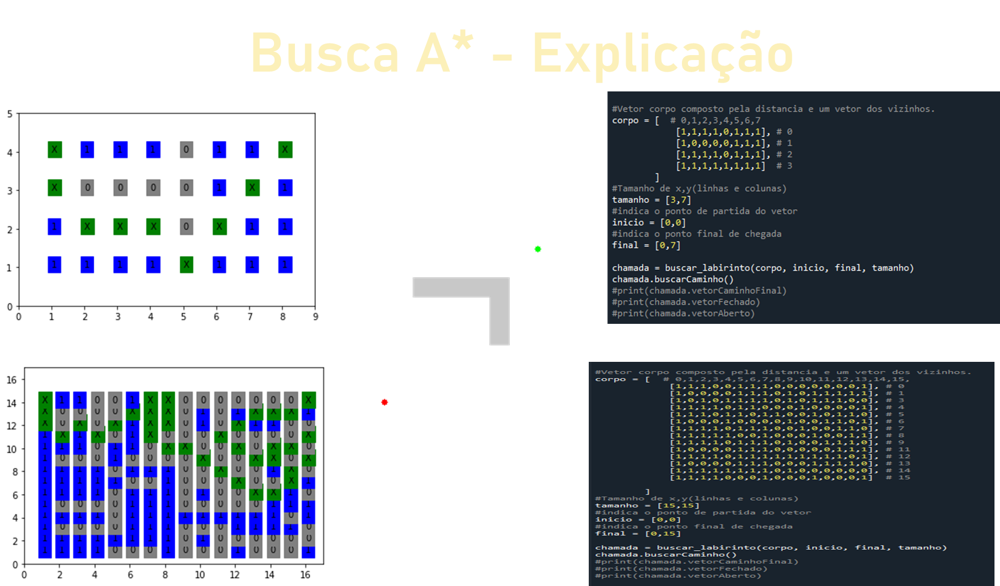

Este código implementa um algoritmo de busca de caminho baseado na distância euclidiana em um labirinto representado por uma matriz 2D. O algoritmo verifica os vizinhos acessíveis de cada ponto, calcula a distância até o ponto final, e adiciona os nós aos vetores vetorAberto e vetorFechado. O caminho encontrado é visualizado usando matplotlib.

Tal projeto foi feito no ano de 2023 em aula, com esse pude compreender mais sobre redes neurais e python

